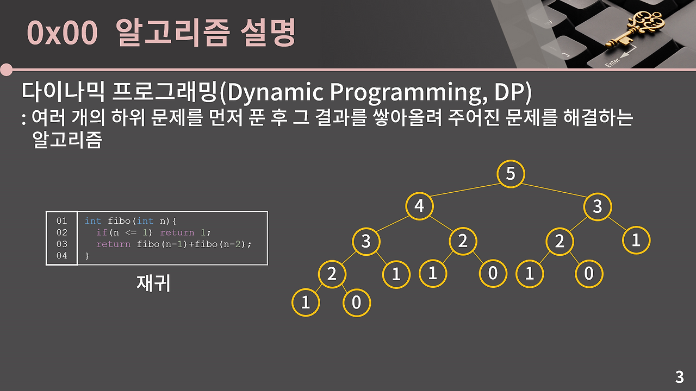

# 다이나믹 프로그래밍

Dynamic Programming 여러 개의 하위 문제를 먼저 푼 후 그 결과를 쌓아올려 주어진 문제를 해결하는 알고리즘으로, 각 하위 문제의 결과를 저장해두고 동일한 하위 문제가 다시 등장할 때 재활용하며, 불필요한 중복 계산을 줄여 효율적인 알고리즘을 설계한다.



쉽게 설명하면 문제를 해결하기 위한 점화식을 찾아낸 후 점화식의 항을 밑에서부터 차례로 구해나가서 답을 알아내는 형태의 알고리즘

→ 이미지와 같이 0번째 인덱스부터 하나씩 채워가는 과정으로 해결할 수 있고 N + 1칸을 채우고 나면 답을 알 수 있으니 O(N)에 답을 알아낼 수 있다. 이렇게 중간 결과를 저장해서 이용하는 지 그렇지 않은 지에 따라 극적인 시간복잡도의 차이가 발생한다.

얼핏 보면 분할 정복과 동일한 개념이다. 큰 문제를 작은 문제로 쪼개고, 작은 문제를 해결한 후 그 결과를 합쳐서 큰 문제를 해결하는 방식이기 때문이다. Recursive로 구현하며, 이는 간단하고 직관적인 구현을 돕는다.

분할 정복에서는 재귀적으로 분할 후 결과를 결합하고, 이떄 하위 문제는 서로에게 독립적이다. 하지만, DP의 경우 이전 계산 결과를 저장 후 재사용하며, 서로 중복이 가능하다.

DP는 최적 부분 구조를 이루는 반면, 재귀적으로 구현했을 때 중복 호출로 심각한 비효율이 발생한다. 

```cpp
fib(6)
 ├── fib(5)
 │    ├── fib(4)
 │    │    ├── fib(3)
 │    │    │    ├── fib(2)
 │    │    │    └── fib(1)
 │    │    └── fib(2)
 │    └── fib(3)
 │         ├── fib(2)
 │         └── fib(1)
 └── fib(4)
      ├── fib(3)
      │    ├── fib(2)
      │    └── fib(1)
      └── fib(2)
```

보면 fibo(3), fibo(2) 같은 함수가 여러 번 반복호출되고 있으며, 스택 메모리 낭비가 심각하게 발생한다.

DP를 푸는 과정은 다음과 같다.

1. 테이블 정의하기
2. 점화식 찾기
3. 초기값 정하기